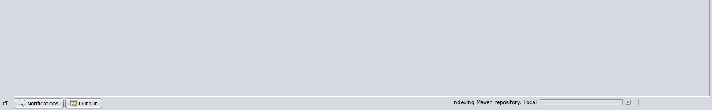
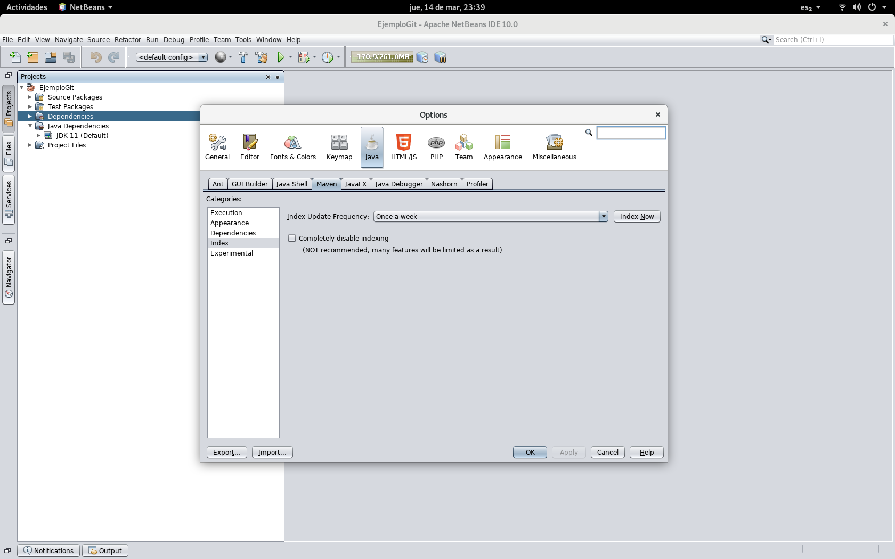
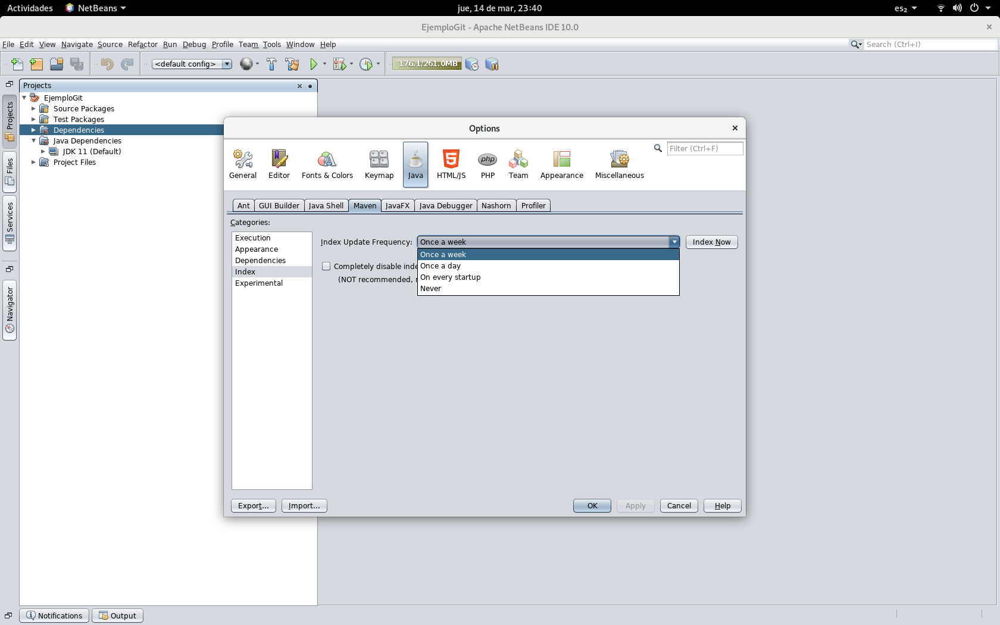
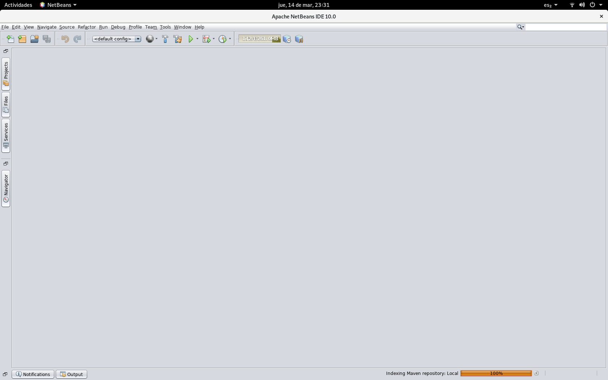

# Configurar indexado de Maven en NetBeans

No me diga, estaba tranquilamente programando en NetBeans cuando de pronto el IDE (si no es que toda la computadora) sufrió un repentino bajón de velocidad, el indicador de CPU empezó a brillar fijo y nada parecía responder, bajo el ratón a la barra de tareas para abrir el Administrador de tareas para ver que pasa, pero entonces lo vio..

ESE mensaje, el Indexando repositorios Maven aparece y sabe lo que implica, NetBeans va a bajar todo el listado de repositorios desde el repositorio central, organizarlos, indexarlos y actualizar la lista local de repositorios, mientras usted ve como Windows esta al borde de colapsar por un semejante esfuerzo (Tengo historias de terror de el proceso dejando una laptop casi inusable por media hora).

Si bien no parece haber nada que se pueda hacer para evitar que tome tanto tiempo y procesador (el reporte de bug sobre eso lleva AÑOS ya) puede evitar que se active sin avisar y que solo sincronice cuando usted desee.

Para hacer esto vaya al menú Herramientas->Opciones y a la pestaña Java

Seleccione la categoría Maven y vera que le da la opción de indicar cada cuanto desea que se actualice el indice de librerías disponibles en Maven pudiendo ser cada semana, diario, cada arranque o nunca.

Si el que el indice se actualice automáticamente es deberás un problema (y en mi laptop lo es) mi recomendación es que seleccione Nunca y listo, ya no se actualizara automáticamente.

Ahora ¿Que se debe hacer si de hecho ocupa la versión mas nueva de una librería, ya sea por una característica nueva o la corrección de un error?, muy simple abra de nuevo ese dialogo y presione el botón Index now y el proceso de bajar e indexar comenzara de inmediato.

